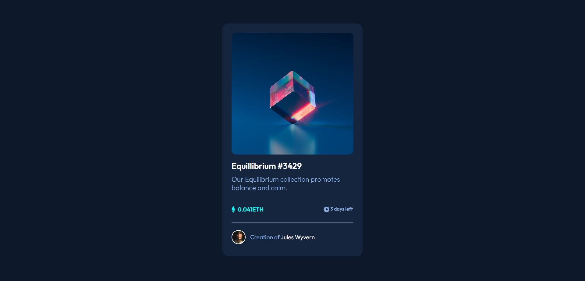

# Frontend Mentor - NFT preview card component solution

This is a solution to the [NFT preview card component challenge on Frontend Mentor](https://www.frontendmentor.io/challenges/nft-preview-card-component-SbdUL_w0U)

## Table of contents

- [Overview](#overview)
  - [The challenge](#the-challenge)
  - [Screenshot](#screenshot)
  - [Links](#links)
- [My process](#my-process)
  - [Built with](#built-with)
  - [What I learned](#what-i-learned)
  - [Useful resources](#useful-resources)
- [Author](#author)

## Overview

### The challenge

Users should be able to:

- View the optimal layout depending on their device's screen size
- See hover states for interactive elements

### Screenshot

### Links

- Solution URL: [GitHub](https://github.com/Sharath-1517/NFT-Card-preview-using-HTML-and-CSS)
- Live Site URL: [GitHub](https://sharath-1517.github.io/NFT-Card-preview-using-HTML-and-CSS/)

## My process

### Built with

- Semantic HTML5 markup
- CSS custom properties
- Flexbox
- [Styled Components - SaSS](https://sass-lang.com/) - For styles

### What I learned

In this project I learnt how to use transitions, hover effects and positions. Also I was able to my thorough flexbox properties.
### Useful resources

- [W3 schools](https://www.w3schools.com) - This helped me for XYZ reason. I really liked this pattern and will use it going forward.
## Author

- Website - [S Sharath Lingam](https://sharathlingam.netlify.app)
- Frontend Mentor - [@Sharath-1517](https://www.frontendmentor.io/profile/Sharath-1517)
- Twitter - [@sharathlingams](https://www.twitter.com/sharathlingams)