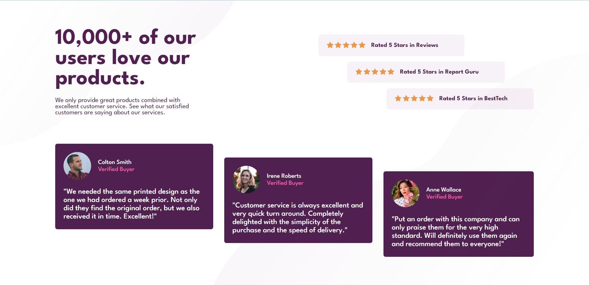

# Frontend Mentor - Social proof section solution

This is a solution to the [Social proof section challenge on Frontend Mentor](https://www.frontendmentor.io/challenges/social-proof-section-6e0qTv_bA). Frontend Mentor challenges help you improve your coding skills by building realistic projects. 

## Table of contents

- [Overview](#overview)
  - [The challenge](#the-challenge)
  - [Screenshot](#screenshot)
  - [Links](#links)
- [My process](#my-process)
  - [Built with](#built-with)
  - [What I learned](#what-i-learned)
- [Author](#author)

## Overview

### The challenge

Users should be able to:

- View the optimal layout for the section depending on their device's screen size

### Screenshot

### Links

- Solution URL: [GitHub](https://github.com/Sharath-1517/Social-Proof-static-site-using-HTML-and-CSS)
- Live Site URL: [GitHub](https://sharath-1517.github.io/Social-Proof-static-site-using-HTML-and-CSS)

## My process

### Built with

- Semantic HTML5 markup
- CSS custom properties
- Flexbox
- Mobile-first workflow
- [Styled Components](https://sass-lang.com/) - For styles

### What I learned

This project was pretty challenging to do. I was able to set the background using positioning and was able to learn about the align-self property which plays an important role in the reviews section. Overall this was pretty challenging. 

## Author

- Website - [S Sharath Lingam](https://sharathlingam.netlify.app)
- Frontend Mentor - [@Sharath-1517](https://www.frontendmentor.io/profile/Sharath1517)
- Twitter - [@yourusername](https://www.twitter.com/sharathlingams)
