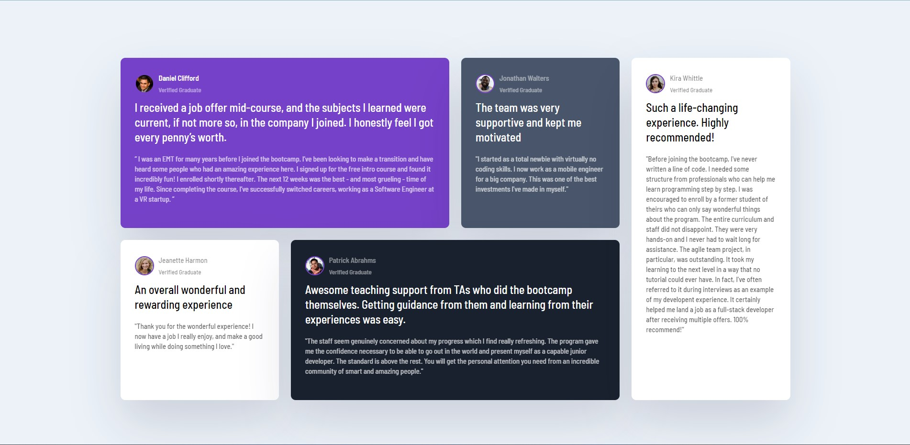

# Frontend Mentor - Testimonials grid section solution

This is a solution to the [Testimonials grid section challenge on Frontend Mentor](https://www.frontendmentor.io/challenges/testimonials-grid-section-Nnw6J7Un7). Frontend Mentor challenges help you improve your coding skills by building realistic projects. 

## Table of contents

- [Overview](#overview)
  - [The challenge](#the-challenge)
  - [Screenshot](#screenshot)
  - [Links](#links)
- [My process](#my-process)
  - [Built with](#built-with)
  - [What I learned](#what-i-learned)
  - [Continued development](#continued-development)
  - [Useful resources](#useful-resources)
- [Author](#author)

## Overview

### The challenge

Users should be able to:

- View the optimal layout for the site depending on their device's screen size

### Screenshot



### Links

- Solution URL: [GitHub](https://github.com/Sharath-1517/Testimonials-using-grid)
- Live Site URL: [GitHub](https://sharath-1517.github.io/Testimonials-using-grid)

## My process

### Built with

- Semantic HTML5 markup
- CSS custom properties
- CSS Grid
- Mobile-first workflow
- [SaSS](https://sass-lang.com/) - For styles

### What I learned

I learnt how to use grid property in CSS. I used the ```grid-column``` and ```grid-row``` to achieve this.

### Continued development

I still have to work on with the mobile view of the challenge.

### Useful resources

- [Traversy Media](https://youtu.be/0xMQfnTU6oo) - This helped me for learning the grid propertiees and it's usage. I really liked this video and will use it going forward.

## Author

- Website - [S Sharath Lingam](https://sharathlingam.netlify.app)
- Frontend Mentor - [@sharath-1517](https://www.frontendmentor.io/profile/Sharath-1517)
- Twitter - [@sharathlingams](https://www.twitter.com/sharathlingams)